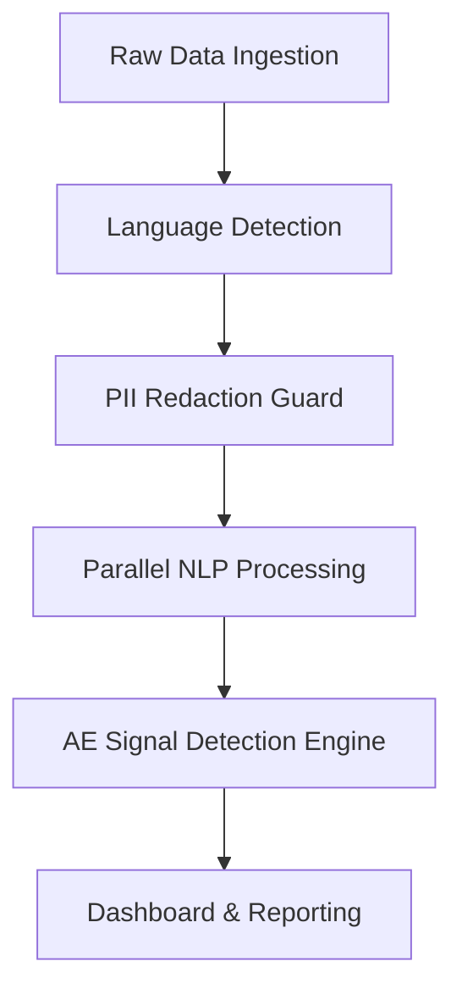

# AlgoPharma: Agentic Pharmacovigilance Pipeline Architecture

This document outlines the end-to-end architecture of AlgoPharma, designed to be presented to hackathon judges. It breaks down the technical stack, the NLP models used, and the agentic workflow that makes this platform robust for real-time Adverse Event (AE) detection from unstructured social media and forum data.

## 1. High-Level Pipeline Flow

### The Data Ingestion Layer
1. **Agentic Forum Onboarding**: Using LLMs (Nvidia Nemotron), the system can analyze the HTML structure of any custom medical forum on the fly, auto-generate a crawler configuration, and extract thread data without manual scraping scripts.
2. **Standard Crawlers**: Pre-built crawlers for Reddit and Twitter handle continuous ingestion of standard social media streams.
3. **Async Processing**: All raw posts are pushed to a **Celery Worker Queue**. This decouples slow NLP inference from the fast web scraping layer, ensuring the system can scale horizontally.

---

## 2. The NLP Pipeline (Step-by-Step)

Once a post is picked up by the Celery worker, it goes through a strict sequence of models. 

### Step 1: PII Redaction Guard (Privacy First)
Before any heavy NLP processing occurs, we ensure all Patient Identifiable Information (PII) is securely masked or replaced with synthetic surrogate data.
- **English**: `OpenMed/OpenMed-PII-SuperClinical-Small-44M-v1`
- **Hindi**: `OpenMed/OpenMed-PII-Hindi-SuperClinical-Small-44M-v1`
- **Telugu**: `OpenMed/OpenMed-PII-Telugu-FastClinical-Small-82M-v1`
- **Regex Fallback**: Hardcoded Indian regex patterns (Aadhaar, PAN, UPI).
*Note: We dynamically parse the text language using `langdetect` and route it to the correct 44M/82M OpenMed model.*

### Step 2: Named Entity Recognition (NER)
We extract medical entities using lightweight, CPU-optimized HuggingFace Transformers.
- **Drug NER**: `OpenMed/OpenMed-NER-PharmaDetect-ModernClinical-149M` (Detects brand names, generics like Paracetamol, Dolo 650).
- **Disease/Symptom NER**: `OpenMed/OpenMed-NER-DiseaseDetect-SuperClinical-184M` (Detects symptoms like nausea, liver discomfort).

### Step 3: Sentiment & Contextual Scoring
- **Model**: `cardiffnlp/twitter-roberta-base-sentiment-latest`
- **Purpose**: Evaluates if the post is NEGATIVE (complaining about a side effect) or POSITIVE/NEUTRAL (just mentioning a drug).
- **Fallback**: VADER sentiment analyzer is loaded in memory for immediate fallback if the transformer fails.

### Step 4: Negation Detection
- **Model**: `spaCy (en_core_web_sm)`
- **Purpose**: A rule-based clinical negation detector. It ensures that "no nausea" or "patient denied stomach pain" are not accidentally flagged as Adverse Events.

---

## 3. The AE Signal Detection Engine

Once the NLP features are extracted, they are passed to the Rule Engine to determine if an Adverse Event (AE) has occurred.

**The AE Rule:**
`IF (Drug is Present) AND (Symptom is Present) AND (Sentiment is Negative) AND (Symptom is NOT Negated) -> FLAG AS ADVERSE EVENT`

**Disproportionality Analysis (PRR/ROR):**
At scale, the system calculates the Proportional Reporting Ratio (PRR) to detect statistical signals (e.g., if "Aspirin" and "Heart Attack" co-occur way more frequently than chance). 
- **STRONG SIGNAL**: PRR ≥ 2, χ² ≥ 4, Count ≥ 3.

---

## 4. Current Limitations & "False Positives"

While the pipeline is highly capable, zero-shot NLP models struggle with **metaphorical or colloquial language**.

**Example:**
> *"Question, I know pain is subjective but iyo how bad does a chest piece hurt?"* (Referring to a chest tattoo)
> *"WHY does she always make claws-out biscuits on my chest and neck?? It actually hurts"* (Referring to a cat)

**Why this happens:**
1. The **Disease NER** correctly identifies "chest hurt" as a valid physiological symptom in isolation.
2. The **Sentiment Model** (trained on Twitter data) correctly identifies the complaint ("it hurts") as Negative.
3. The pipeline combines these and flags it as an AE because it lacks the deep *clinical context* to know the user is talking about a tattoo or a cat.

**How we address this (Future Work):**
To solve this, the next iteration of AlgoPharma would introduce a **Clinical Context Classifier** (e.g., ClinicalBERT fine-tuned on non-medical vs. medical text) as a gatekeeper *before* the NER step, filtering out metaphorical uses of medical terms.
