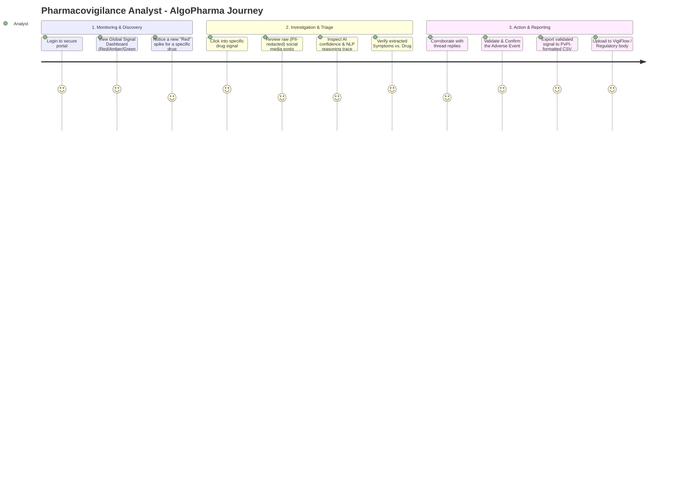
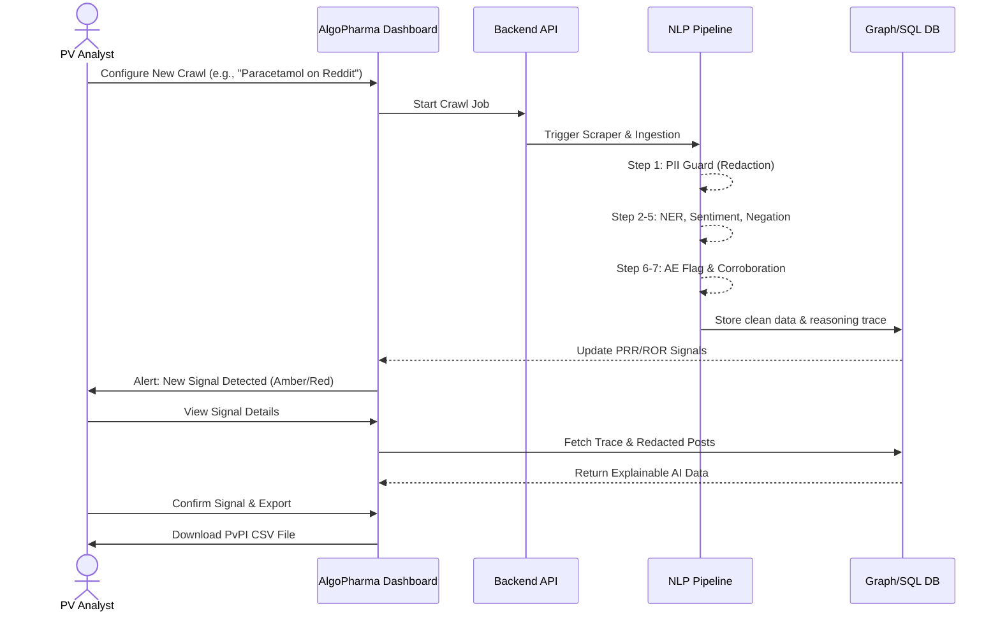

# AlgoPharma User Journey Architecture

This document outlines the end-to-end user journeys for the primary personas interacting with the AlgoPharma Pharmacovigilance platform. It maps the user experience directly to the underlying NLP and Data pipelines.

## 👥 User Personas

1. **Pharmacovigilance (PV) Analyst / Medical Reviewer**
   * **Goal:** Identify, verify, and report adverse drug reactions (ADRs) quickly.
   * **Needs:** Clear dashboards, explainable AI reasoning, easy export to regulatory formats (VigiFlow).
2. **Data Engineer / System Administrator**
   * **Goal:** Maintain data pipelines and system health.
   * **Needs:** Crawler configuration, pipeline monitoring, API management.

---

## 🗺️ User Journey Map (PV Analyst)

---

## 🔄 End-to-End System Flow (User Perspective)

---

## 📝 Step-by-Step Feature Mapping

### Phase 1: Ingestion & Setup
* **User Action:** The user configures a live scraper for specific subreddits or Twitter keywords, or uploads a batch CSV of historical data.
* **System Response:** The system validates the input and begins asynchronous ingestion. The UI shows a progress bar. 

### Phase 2: Processing & PII Protection
* **User Action:** The user waits while the system processes the data.
* **System Response:** Behind the scenes, **Step 1 (PII Guard)** is executed. All patient names, phone numbers, and IDs are stripped. This ensures that when the user eventually sees the text, it is completely anonymized and regulatory compliant.

### Phase 3: Signal Dashboard
* **User Action:** The user logs in and views the main dashboard.
* **System Response:** The UI queries the database for PRR/ROR (Proportional Reporting Ratio) calculations. It displays drugs categorized by risk bands:
  * 🔴 **Red:** Urgent signal, PRR > 2, sudden spike.
  * 🟡 **Amber:** Emerging signal, requires monitoring.
  * 🟢 **Green:** Baseline noise, no action needed.

### Phase 4: Drill-Down & Explainability
* **User Action:** The user clicks on a "Red" signal for a specific drug (e.g., Dolo 650) to see *why* it was flagged.
* **System Response:** The system displays the individual posts. For each post, it highlights:
  * The identified **Drug** (from NER).
  * The identified **Symptom** (from NER).
  * The **Sentiment** (Negative).
  * The **Negation Status** (Confirming the symptom was *not* negated).
  * The **Thread Corroboration Score** (How many replies agree with the OP).

### Phase 5: Export & Compliance
* **User Action:** The user agrees with the AI's assessment, marks the signal as `CONFIRMED`, and clicks "Export to VigiFlow".
* **System Response:** The system generates a pre-formatted CSV matching the Pharmacovigilance Programme of India (PvPI) standards, ready for immediate upload to official regulatory portals.
